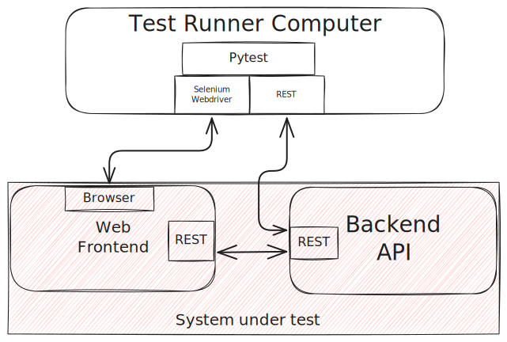
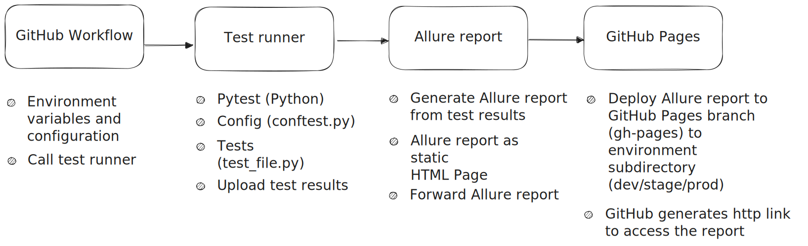

<div align="center">
<h1 aligh="center">Python Selenium Framework</h1>
</div>

## Overview
This project was created to act as a template and practise for future frameworks using the same technology stack ``(Python, Pytest, Selenium, Allure Report)``.

This framework is developed against the following practice website and the respective API:
* (https://practicesoftwaretesting.com/) 
* (https://api.practicesoftwaretesting.com/api/documentation)


### Features
* Frontend testing
    * Page Object Model (POM) used to model the target webpages.
    * Multi-browser test execution (Chrome, Firefox, Edge).
* API testing
    * API interface modeling against the target OpenAPI schema, enhancing tests orchestration.
* Static type checking
    * Using Mypy, static type checking is implemented as tests in the test suite.
* CI/CD integration
    * Test runs are integrated and triggered using GitHub actions.
    * Test report is deployed to GitHub pages for better accessibilty.
* Reporting
    * Console logs, browser logs and screenshots are collected at the end of each testcase.
    * Allure report is generated using the test results from Pytest.
    * The collected logs and screenshots are attached to the Allure report for each testcase.
    * Designated landing page for multi-environment support (Dev, Stage, Production).

> [!NOTE]
> Test reports custom landing page: (https://shadyzahran.github.io/python-selenium/)

## Getting Started
The project is currently setup to run in a CI/CD environment, but it can also be used locally as follows:

### Installation (MacOS)
1. Install Python 3.12+
```shell
brew install python@3.12
```
2. Install Poetry
```shell
curl -sSL https://install.python-poetry.org | python3 -
```
3. Go to project root directory
4. Install dependencies using Poetry
```shell
poetry install
```

### Usage
1. Run tests
```shell
poetry run pytest # will run against all browsers (chrome, firefox and edge)
poetry run pytest --target-browser chrome # will run only for chrome
```
> [!IMPORTANT]
> check the `pyproject.toml` file for the implicit pytest configuration
2. Generate and view the Allure report
```shell
allure serve
```
## Project Breakdown
### File Structure
* `/tests`
    * `/api` API tests
    * `/frontend` Frontend tests
    * `/type_checking` Type checking tests
    * `conftest.py` Configuration and setup for testcase execution
* `/pages`
    * `base_page.py` Parent class with common functionality to be used by child page classes
* `/interfaces`
    * `practice_backend_api.py` This contains the modeled requests against the project openapi schema, to be utilizied by the tests
* `.github/workflows`
    * `run_tests_dev.yml` workflow to run tests on dev environment
    * `run_allure_reporter.yml` workflow to generate allure report from the test results and deploy it on the designated github pages branch and environment subdirectory

### System boundary
This diagram shows the overall system components and how they interface with one another, while outlining the system components that are under the test scope:




### Process diagram
This diagram shows how the process is setup to execute on the CI/CD pipeline:

